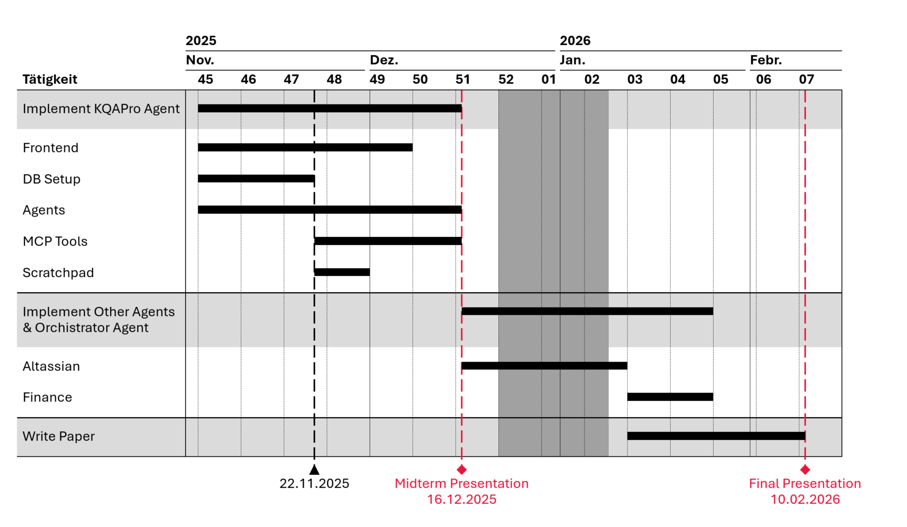

# AMA KBQA

## TODO

- [ ] Implement Graph Scratchpad using the `networkx` library

## Timeline


## Setup

1. Clone the repo
2. Download the KQAPro Dataset from [here](https://huggingface.co/datasets/drt/kqa_pro/blob/main/kb.json)
3. place the kb.json file into this folder: `db/datasets/kqapro`
4. Run `convert_kb_to_nt.py` in order to transform the .json file to .nt, a format which can be read by qlever
5. Start the Databases by using

```bash
cd db
docker compose up -d
```

6. Populate the Virtuoso Database by using

```bash
docker exec -i virtuoso_ama_kbqa isql 1111 dba kit_ama_kbqa "EXEC=ld_dir('/usr/share/proj', 'kb.nt', 'http://kqapro.org/kb'); rdf_loader_run(); checkpoint;"
```

7. Setup Qdrant by running the `populate_vector_db.py` file

You can test Virtuoso by opening http://localhost:8890/sparql and running this query:

```sparql
PREFIX ex:   <http://kqapro.org/entity/>
PREFIX prop: <http://kqapro.org/property/>
PREFIX attr: <http://kqapro.org/attribute/>
PREFIX qual: <http://kqapro.org/qualifier/>
PREFIX unit: <http://kqapro.org/unit/>
PREFIX rdfs: <http://www.w3.org/2000/01/rdf-schema#>
PREFIX rdf:  <http://www.w3.org/1999/02/22-rdf-syntax-ns#>
PREFIX xsd:  <http://www.w3.org/2001/XMLSchema#>

SELECT ?date
WHERE {
  ?person rdfs:label "Barack Obama" .
  ?person attr:date_of_birth ?date .
}
```

## Qdrant Database Schema Summary

### Collection 1: `kqapro-entities`

**Purpose:** Stores specific nodes (Entities) and general classes (Concepts) for "Entity Linking".

- **Vector:**
  - **Source:** The `name` field of the JSON object (e.g., "Albert Einstein", "City").
  - **Dimension:** 4096 (using `qwen/qwen3-embedding-8b`).
- **Payload (Metadata):**
  ```json
  {
    "original_id": "Q937",           // The original string ID from kb.json
    "node_type": "entity",           // "entity" or "concept" (for filtering)
    "name": "Albert Einstein",
    "instanceOf": ["Q5"],            // List of parent concept IDs
    "attributes": [...],             // Full list of attributes (not vectorized, just stored)
    "relations": [...]               // Full list of raw relations (not vectorized, just stored)
  }
  ```

---

### Collection 2: `kqapro-relations`

**Purpose:** Stores unique predicates to act as a "Schema Mapper" for generating SPARQL queries.

- **Vector:**
  - **Source:** The unique `predicate` string (e.g., "place_of_birth", "has_population").
  - **Dimension:** 4096.
- **Payload (Metadata):**
  ```json
  {
    "predicate": "place_of_birth", // The exact predicate used in SPARQL
    "type": "relation_schema" // Fixed tag for identification
  }
  ```

## KQAPro Dataset Format

### Raw kb.json File

```
{
    'concepts':
    {
        '<id>':
        {
            'name': str,
            'instanceOf': ['<id>', '<id>'], # ids of parent concept
        }
    },
    'entities': # excluding concepts
    {
        '<id>':
        {
            'name': str,
            'instanceOf': ['<id>', '<id>'], # ids of parent concept
            'attributes':
            [
                {
                    'key': str, # attribute key
                    'value':  # attribute value
                    {
                        'type': 'string'/'quantity'/'date'/'year',
                        'value': float/int/str, # float or int for quantity, int for year, 'yyyy/mm/dd' for date
                        'unit': str,  # for quantity
                    },
                    'qualifiers':
                    {
                        '<qk>':  # qualifier key, one key may have multiple corresponding qualifier values
                        [
                            {
                                'type': 'string'/'quantity'/'date'/'year',
                                'value': float/int/str,
                                'unit': str,
                            }, # the format of qualifier value is similar to attribute value
                        ]
                    }
                },
            ]
            'relations':
            [
                {
                    'predicate': str,
                    'object': '<id>', # NOTE: it may be a concept id
                    'direction': 'forward'/'backward',
                    'qualifiers':
                    {
                        '<qk>':  # qualifier key, one key may have multiple corresponding qualifier values
                        [
                            {
                                'type': 'string'/'quantity'/'date'/'year',
                                'value': float/int/str,
                                'unit': str,
                            }, # the format of qualifier value is similar to attribute value
                        ]
                    }
                },
            ]
        }
    }
}
```

### Processed in Virtuoso:

#### Namespace Prefixes

To make your queries readable, you should define these prefixes at the start of your SPARQL query:

```sparql
PREFIX ex:   <http://kqapro.org/entity/>
PREFIX prop: <http://kqapro.org/property/>
PREFIX attr: <http://kqapro.org/attribute/>
PREFIX qual: <http://kqapro.org/qualifier/>
PREFIX unit: <http://kqapro.org/unit/>
PREFIX rdfs: <http://www.w3.org/2000/01/rdf-schema#>
PREFIX rdf:  <http://www.w3.org/1999/02/22-rdf-syntax-ns#>
PREFIX xsd:  <http://www.w3.org/2001/XMLSchema#>
```
